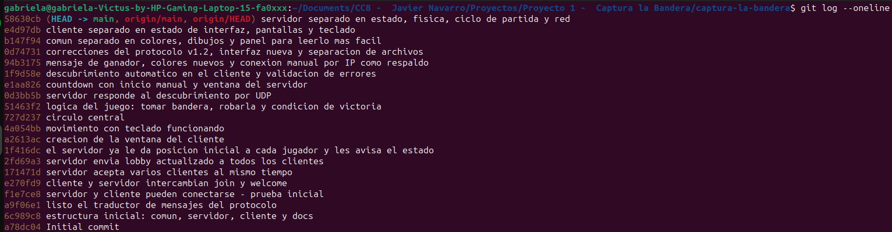

# Bitácora de desarrollo

Este documento narra la cronología real del proyecto, de principio a fin, con cada entrada enlazada a los commits del repositorio que la respaldan. Los mensajes de commit fueron redactados en el momento en que ocurrió cada avance; esta bitácora los organiza y les da contexto.

Repositorio: [github.com/AdolfoNav10/captura-la-bandera](https://github.com/AdolfoNav10/captura-la-bandera)

---

## 18 de julio — Arranque del proyecto

Se creó el repositorio y la estructura inicial de carpetas (`comun`, `servidor`, `cliente`, `docs`), a partir del análisis del estándar de protocolo acordado en clase.

- `a78dc04` — Initial commit
- `6c989c8` — estructura inicial: comun, servidor, cliente y docs

**Decisión:** separar desde el día 1 el código en tres carpetas según responsabilidad (protocolo compartido, servidor, cliente), en vez de un solo archivo, anticipando que ambos modos del programa necesitarían compartir la misma lógica de mensajes.

---

## 19 de julio — El protocolo y la primera conversación

Día más largo de trabajo. Se construyó, en orden:

1. El traductor de mensajes: framing por línea (`\n`) sobre TCP, con manejo de mensajes partidos o pegados.
2. La primera conexión real cliente-servidor.
3. El intercambio `join` → `welcome`.
4. Que el servidor acepte varios clientes a la vez (uso de hilos).
5. El broadcast de `lobby` a todos los clientes conectados.
6. Posiciones iniciales por jugador y el ciclo de `state` a 20 ticks/segundo.
7. La primera ventana gráfica del cliente (pygame).
8. Movimiento con teclado (WASD) sincronizado entre varios clientes.
9. El círculo central dibujado en pantalla.
10. La lógica completa del juego: tomar la bandera, robarla, y condición de victoria.

- `a9f06e1` — listo el traductor de mensajes del protocolo
- `f1e7ce8` — servidor y cliente pueden conectarse - prueba inicial
- `e270fd9` — cliente y servidor intercambian join y welcome
- `171471d` — servidor acepta varios clientes al mismo tiempo
- `2fd69a3` — servidor envia lobby actualizado a todos los clientes
- `1f416dc` — el servidor ya le da posicion inicial a cada jugador y les avisa el estado
- `a2613ac` — creacion de la ventana del cliente
- `4a054bb` — movimiento con teclado funcionando
- `727d237` — circulo central
- `51463f2` — logica del juego: tomar bandera, robarla y condicion de victoria

**Decisión:** el framing de mensajes se probó explícitamente con datos partidos a la mitad antes de seguir con cualquier otra cosa, porque toda la comunicación TCP del proyecto depende de que esa pieza funcione bien.

---

## 21 de julio — Descubrimiento y control de partida

- `0d3bb5b` — servidor responde al descubrimiento por UDP
- `e1aa826` — countdown con inicio manual y ventana del servidor
- `1f9d58e` — descubrimiento automatico en el cliente y validacion de errores

**Cambio de rumbo:** el countdown se probó primero como automático (arrancaba al conectarse el primer jugador), pero esto entraba en conflicto con la regla de rechazar `join` durante una partida ya iniciada — un jugador que tardaba en conectarse quedaba afuera. Se rediseñó como inicio manual: el servidor tiene su propia ventana y arranca la cuenta regresiva con ENTER, solo cuando el anfitrión decide que ya están todos en el lobby. Esta decisión también resolvió, de forma incidental, el requisito del enunciado de que el modo servidor muestre la partida en pantalla.

---

## 22 de julio — Primera interoperabilidad real y hallazgo de bugs

- `94b3175` — mensaje de ganador, colores nuevos y conexion manual por IP como respaldo

Esta sesión incluyó pruebas de conexión real con compañeros de la clase (vía hotspot e IP directa), sin que ese trabajo de diagnóstico quedara reflejado en commits propios — el commit de esta fecha agrupa únicamente los cambios de código que resultaron de esas pruebas.

**Hallazgos de la sesión (documentados también en `protocolo.md`):**
- El servidor no distinguía redes distintas (subredes de hotspot incompatibles entre dispositivos); se confirmó que era una limitación de red, no del código.
- Se agregó el respaldo de conexión manual por IP en el cliente, exigido además por el estándar de la clase como vía alterna al broadcast.

---

## 27 de julio — Actualización al protocolo v1.2 y refactor completo

El estándar de la clase se actualizó a la versión 1.2.0 (documento fechado 25 de julio), con reglas considerablemente más estrictas que el borrador inicial: código de error `GAME_STARTED`, mínimo de 2 jugadores para iniciar countdown, transición post-partida de 5 segundos con regreso automático al lobby, spawn de jugadores en anillo, normalización de movimiento diagonal, y códigos de error en mayúsculas, entre otros cambios.

Al revisar el proyecto contra la nueva versión del estándar, y tras una sesión de pruebas de interoperabilidad con un compañero (conexión vía VPN, primero Tailscale y luego Radmin VPN por mejores resultados), se identificaron y corrigieron varios problemas reales de conformidad que no habían aparecido en pruebas locales:

- Los datagramas UDP de descubrimiento llevaban un salto de línea (`\n`) de más, que el estándar prohíbe explícitamente para UDP.
- Las posiciones enviadas en `state` llevaban más decimales de los permitidos.
- El mensaje `state` podía llegar a un cliente antes que `start`, violando el orden de fases.
- El servidor no normalizaba el movimiento diagonal, dando ventaja de velocidad injusta.
- Faltaban varias validaciones y cierres de conexión exigidos por la tabla de errores del estándar.

Con el protocolo ya conforme y probado, se rediseñó la interfaz gráfica (menú principal, selección de servidor, panel de jugadores, paleta de colores) y finalmente se reorganizó todo el código en módulos más pequeños y de una sola responsabilidad, para facilitar su lectura y estudio.

- `0d74731` — correcciones del protocolo v1.2, interfaz nueva y separacion de archivos
- `b147f94` — comun separado en colores, dibujos y panel para leerlo mas facil
- `e4d97db` — cliente separado en estado de interfaz, pantallas y teclado
- `58630cb` — servidor separado en estado, fisica, ciclo de partida y red

**Decisión:** priorizar la conformidad exacta con el estándar por sobre dejar el código como estaba, aun habiendo funcionado ya con varios compañeros — el objetivo era la interoperabilidad garantizada, no solo la que da la suerte de una prueba particular.

---

## Resumen de commits (orden cronológico)

| Commit | Mensaje | Fecha |
|---|---|---|
| `a78dc04` | Initial commit | 18 jul |
| `6c989c8` | estructura inicial: comun, servidor, cliente y docs | 18 jul |
| `a9f06e1` | listo el traductor de mensajes del protocolo | 19 jul |
| `f1e7ce8` | servidor y cliente pueden conectarse - prueba inicial | 19 jul |
| `e270fd9` | cliente y servidor intercambian join y welcome | 19 jul |
| `171471d` | servidor acepta varios clientes al mismo tiempo | 19 jul |
| `2fd69a3` | servidor envia lobby actualizado a todos los clientes | 19 jul |
| `1f416dc` | el servidor ya le da posicion inicial a cada jugador y les avisa el estado | 19 jul |
| `a2613ac` | creacion de la ventana del cliente | 19 jul |
| `4a054bb` | movimiento con teclado funcionando | 19 jul |
| `727d237` | circulo central | 19 jul |
| `51463f2` | logica del juego: tomar bandera, robarla y condicion de victoria | 19 jul |
| `0d3bb5b` | servidor responde al descubrimiento por UDP | 21 jul |
| `e1aa826` | countdown con inicio manual y ventana del servidor | 21 jul |
| `1f9d58e` | descubrimiento automatico en el cliente y validacion de errores | 21 jul |
| `94b3175` | mensaje de ganador, colores nuevos y conexion manual por IP como respaldo | 22 jul |
| `0d74731` | correcciones del protocolo v1.2, interfaz nueva y separacion de archivos | 27 jul |
| `b147f94` | comun separado en colores, dibujos y panel para leerlo mas facil | 27 jul |
| `e4d97db` | cliente separado en estado de interfaz, pantallas y teclado | 27 jul |
| `58630cb` | servidor separado en estado, fisica, ciclo de partida y red | 27 jul |

